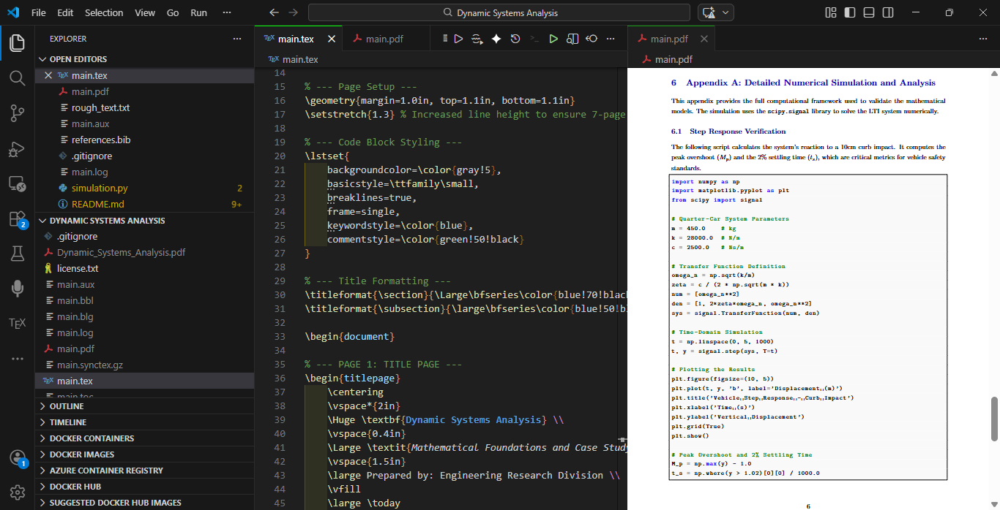

# 🏎️ Dynamic Systems Analysis: Quarter-Car Engine


**Dynamic Systems Analysis** is a technical engineering suite designed to model and simulate vehicle suspension behavior. By bridging the gap between theoretical **Laplace Transforms** and real-world **Python simulations**, this project provides a 7-page analytical framework for exploring Linear Time-Invariant (LTI) second-order systems.

## 🚀 Features

* **Mathematical Derivation:** Full s-domain transformation of mechanical ODEs.
* **Quarter-Car Case Study:** Real-world parameters for luxury sedan stability analysis.
* **Transient Response:** Detailed calculation of Peak Overshoot ($M_p$) and Settling Time ($t_s$).
* **Frequency Analysis:** Integrated Bode Plotting to identify critical resonance peaks.
* **Active Control:** Conceptual framework for PID feedback integration.
* **Automated Booklet:** Professional LaTeX source for generating a high-density technical report.

---

## 🛠️ Tech Stack

| Layer            | Technology                         |
| :--------------- | :--------------------------------- |
| **Simulations**  | Python 3.10+, SciPy (Signal)       |
| **Typesetting**  | LaTeX (MiKTeX / TeX Live)          |
| **Data Viz**     | Matplotlib, NumPy                  |
| **Analysis**     | Laplace Transforms, Bode Theory    |

---

## 📂 Project Structure

```text
Dynamic-Systems-Analysis/
├── main.tex              (Core LaTeX Source - 7 Page Technical Report)
├── references.bib        (Citations for Engineering Literature)
├── simulation.py         (Python script for Step Response & Bode Plots)
├── .gitignore            (LaTeX & Python build-file exclusions)
├── LICENSE.txt           (MIT License)
└── README.md             (Project Documentation)

```

---

## ⚙️ How to Run

1. **Simulate the Physics:**
Ensure you have `scipy` and `matplotlib` installed, then run the simulation script:
```bash
python simulation.py

```


2. **Generate the Technical Booklet:**
Compile the LaTeX source using the following sequence to resolve all citations and cross-references:
```bash
pdflatex main.tex
bibtex main
pdflatex main.tex
pdflatex main.tex

```

---


## 🧮 Mathematical Model

The system is governed by the second-order differential equation:

$$m\ddot{x} + c\dot{x} + kx = F(t)$$


<p align="center">  </p>

Converted to the $s$-domain, the transfer function $H(s)$ is:

$$H(s) = \frac{\omega_n^2}{s^2 + 2\zeta\omega_n s + \omega_n^2}$$

---

## 📈 Key Results

* **Damping Ratio ():** 0.35 (Underdamped).
* **Natural Frequency ():** 7.89 rad/s.
* **Settling Time ():** ~1.45s (2% criterion).
* **Resonance Peak:** Significant cabin amplification at  rad/s.

---

## 👨‍💻 Author

**Meet Potdar**
*Full-Stack & Systems Developer*

<p align="center">

</p>

---

*Built with 🏎️ for Vehicle Dynamics & Control Systems Research*
